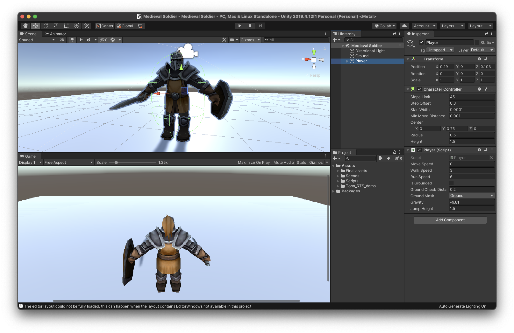
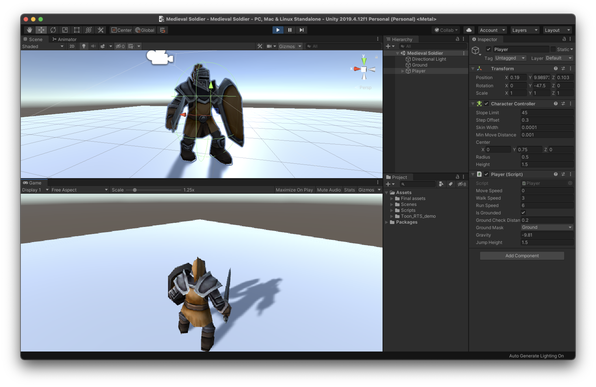

# Medieval-Soldier

In this experiment I wanted to insight some concepts about character controller, global and local positioning.

I liked 
 - handling gravity with `Phisics.CheckSphere()` and using `LayerMask` for the ground object
 - Updating separately Vector3 `_verticalPosition` and `_moveDirections` to save the current position of the player
- overll how the code has been structured

Made with ❤️ in Unity